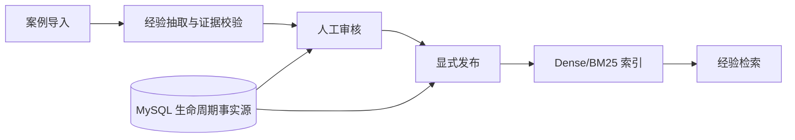
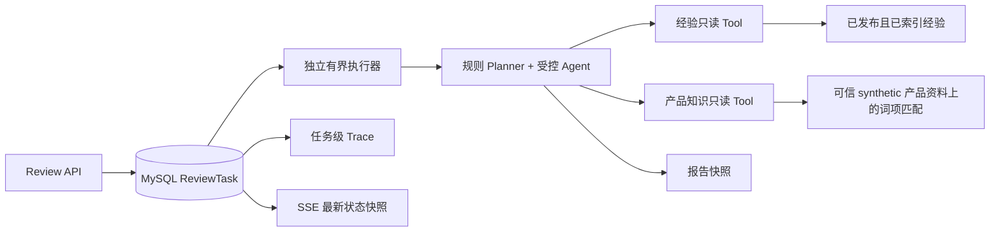

# SalesMentor｜销售沟通复盘与经验辅助系统

SalesMentor 基于销售沟通文本构建带原文证据的经验候选，经人工审核、显式发布后参与检索；系统根据当前任务选择经验或产品知识检索，输出分区引用的结构化复盘报告。

这是一个可审计的 Spring Boot 模块化单体项目。首页演示入口：

- [Day 7 本地演示指南](docs/day7-demo.md)
- [Day 7 实际演示记录](docs/day7-demo-results.md)
- [V1 能力边界](docs/v1-capabilities.md)

## 解决的问题

- 销售案例难以沉淀为可追溯、可审核的经验；
- 历史经验、产品事实和当前沟通观察容易混淆；
- 异步复盘需要可查询的状态、失败收口和可信引用。

项目不使用未经验证的成交率、转化率或效率提升数字作为结论。

## 两条核心能力

### 可审核的经验资产与生命周期门禁检索

- 结构化 `ExperienceUnit`，带 `evidenceQuote` 与原文 offset；
- 人工审核与显式发布，生命周期为 `GENERATED → VERIFIED → PUBLISHED`；
- 只有 MySQL 中 `PUBLISHED + INDEXED` 的经验可以进入检索；
- 经验检索使用 Dense/BM25 Weighted RRF，残留索引不能绕过生命周期门禁。

### 受控的证据复盘流程

- 当前使用确定性规则 Planner，不是 LLM 自主规划；
- 两只白名单只读 Tool，每只最多调用一次，Runtime 串行执行；
- 报告分为当前观察、历史经验、产品事实和建议，并校验引用 ID、来源及 quote/offset 归属；
- ReviewTask 使用 MySQL 严格 CAS，配有独立有界提交、任务级脱敏 Trace、SSE 状态快照和超时终态收口。

项目中的经验抽取适配器与当前复盘规划/报告实现是不同边界；不能将整个项目笼统描述为完全没有模型，也不能将当前复盘描述为 LangChain4j 自动 Tool Calling。

## 架构

经验资产链路：



复盘任务链路：



MySQL 是任务和生命周期的事实源；索引是可重建的派生数据；Trace 和 SSE 只是观测入口。当前产品检索不是已实现的产品 Dense/BM25 双索引，而是受信任 synthetic 资料上的确定性词项检索。

## 实际报告摘要

以下来自 [隔离 local 演示记录](docs/day7-demo-results.md)，是已记录的实际结果摘要，不是固定响应模板：

| 场景 | 当前观察 | 历史经验 | 产品事实 | 记录到的限制 |
|---|---:|---:|---:|---|
| 仅经验信号 | 1 | 0 | 0 | 未找到已发布且已索引的匹配证据；evidence insufficient |
| 仅产品事实信号 | 1 | 0 | 3 | 空 |
| 双信号 | 1 | 0 | 3 | 未找到已发布且已索引的匹配证据 |
| 无检索信号 | 1 | 0 | 0 | no retrieval tool selected |

产品引用来自 V2 synthetic 文档 `DOC-3001`、`DOC-3002`、`DOC-3003`。隔离库没有已发布经验，因此没有伪造 `EXP-*` 引用。`SUCCEEDED` 只表示报告通过归属校验并保存了合法 JSON 快照，不表示证据充足、建议有效或带来商业效果；必须查看 `limitations` 和 `references`。

正向人工审核、发布以及 `EXP-*` 引用演示尚未完成。经验候选仍需人工判断，不能把证据位置正确自动等同为优秀经验。

## 快速启动

前置条件：Java 17、Maven 3.6+、Docker Desktop，以及 local 模式的 MySQL。local 模式使用进程内 Feature Hashing、向量索引、BM25 和内存会话，不需要 Redis、Pinecone 或 API Key。

```powershell
cd <checkout>\salesmentor-repo
docker compose up -d mysql
$env:RAG_MODE = "local"
mvn clean verify
java -jar .\target\salesmentor-1.0.0.jar
```

默认服务端口为 `8080`，数据库连接由 `MYSQL_URL`、`MYSQL_USER`、`MYSQL_PASSWORD` 覆盖。隔离演示曾使用宿主端口 `3307` 和服务端口 `8081`，不能与默认端口混淆。完整 PowerShell 请求、四类 UTF-8 JSON 示例和经验链路步骤见 [演示指南](docs/day7-demo.md)。

最小复盘请求：

```powershell
$created = Invoke-RestMethod -Method Post -Uri http://localhost:8080/api/reviews `
  -ContentType 'application/json; charset=utf-8' `
  -Body (Get-Content .\docs\examples\review-no-retrieval.json -Raw -Encoding UTF8)
$taskId = $created.taskId
curl.exe -N -H "Accept: text/event-stream" "http://localhost:8080/api/reviews/$taskId/events"
Invoke-RestMethod "http://localhost:8080/api/reviews/$taskId"
Invoke-RestMethod "http://localhost:8080/api/reviews/$taskId/traces"
```

`ACCEPTED` 仅表示任务进入进程内有界执行器；队列满时返回 `503 REVIEW_QUEUE_FULL` 并保留 `taskId`。SSE 是最新状态通知，可能跳过未观察到的中间状态，断开不会取消后台任务；客户端应在终态后通过 GET 获取报告。

## 已验证与限制

- 冻结代码提交：`6644f9f`；最近一次已记录全量验证为 `152 tests`，0 failures、0 errors、0 skipped；真实 MySQL Testcontainers 与 Flyway V1/V2/V3 通过。这是一次记录的验证结果，不是动态 CI 状态。
- 规则 Planner、确定性报告和 synthetic 产品资料不等同于 LLM 自主规划、真实报价或商业效果保证。
- 引用归属校验不证明建议在语义上正确或有效；Trace 只有任务级事件；SSE 不提供 Token 流或完整历史回放。
- 执行器队列在内存中，重启不自动重投 `PENDING`；超时 FAILED 不保证底层调用已终止；部署需保持 DATETIME/Clock 的一致时区语义。
- 尚无专门复盘前端、复杂权限模型或公网在线演示，不能描述为可直接公开部署的生产 SaaS。

## 项目演进

SalesMentor 由 [research-rag-assistant](https://github.com/movovm/research-rag-assistant) 演进而来。旧通用 RAG 链路仍保留在代码和历史文档中；本 README 首页聚焦当前销售复盘能力。项目许可证为 [MIT](LICENSE)。
