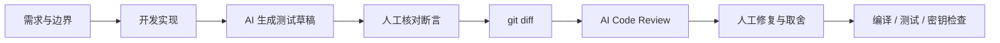

# AI-Assisted Development

## Workflow

AI 不是代码责任主体。可合并代码必须满足：开发者理解实现、测试真实运行、异常和边界路径有断言、敏感信息未进入 Diff、AI Review 的每项建议都经过人工判断。

## Evidence in this repository

| 协作任务 | 可审查证据 |
|---|---|
| 单元测试草稿 | `src/test/`，覆盖 Query Rewrite、分词、分块、混合检索、记忆压缩和端到端问答 |
| Diff 驱动 Review | `docs/prompts/code-review.md`，固定输入边界和三级问题格式 |
| 项目上下文 | `AGENTS.md`，记录架构、业务规则、验证命令和安全边界 |
| README 维护 | README 的双模式说明、复现步骤、事实边界和 Production gaps |
| 自动验证 | `.github/workflows/ci.yml` 执行测试与敏感信息扫描 |

## Metric boundary

简历中的团队试点数据来自小样本、前后周期对比：缺陷反馈数约从 5 降至 2；单测典型耗时约从 90 分钟降至 15 分钟；人工 CR 典型耗时约从 90 分钟降至 22.5 分钟。样本规模有限、任务复杂度未完全控制，因此只能描述为“团队内部试点”，不能外推为线上质量指标。

本仓库只把可重复验证的编译、测试、API 响应与截图作为自身结果，不把上述团队数据包装成本仓库基准。
