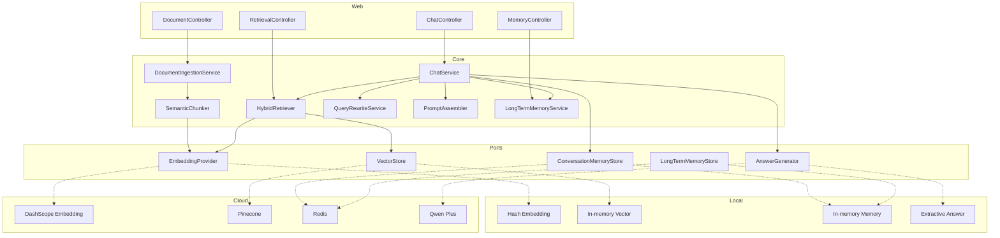

# Architecture

## Boundary

核心层只依赖 `EmbeddingProvider`、`VectorStore`、`ConversationMemoryStore`、`LongTermMemoryStore` 与 `AnswerGenerator` 端口。`local` 和 `cloud` 适配器由 `app.rag.mode` 条件装配，业务编排不感知基础设施差异。

## Security

- 10MB 上传上限，文件名去除换行与路径字符
- API Key、Pinecone host、Redis 地址全部使用环境变量
- Prompt 要求只依据检索证据回答，证据为空时本地模式明确拒答
- 上传文本不会写入项目目录；默认模式只保存在当前进程内
- 公开版不包含简历联系方式、真实团队文档和个人文件路径

## Production gaps

本仓库是作品集，不假装生产系统。实际生产化还需要认证授权、租户隔离、病毒扫描、持久化 BM25、文档删除/重建、可观测性、离线评测集、Reranker 与限流熔断。
