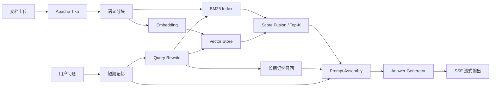

# Research RAG Assistant

基于 Spring Boot、LangChain4j 文档模型、BM25 与向量检索构建的科研资料智能检索与知识问答系统。面向课题组项目资料、技术报告、研发规范和新人手册等分散文档，提供可追溯的 RAG 问答与检索调试能力。

> 本仓库是校招公开展示版。默认 `local` 模式无需 API Key、Redis 或 Pinecone，启动后即可完整演示文档入库、混合检索、记忆、查询改写和 SSE 流式回答；`cloud` 模式提供百炼、Pinecone 与 Redis 的真实适配代码。

启动后的第一屏就是可操作的知识库工作台：左侧展示文档与索引配置，中间进行流式问答，右侧同步展示 Query Rewrite、处理链路和 Top-K 召回证据；“检索调试”页可独立比较 BM25、Dense 与融合分数。

## 30 秒了解项目

- 文档处理：Apache Tika 多格式解析 → 元数据标注 → 相邻语义合并分块 → 双索引写入
- 问答链路：短期记忆 → Query Rewrite → 长期记忆 → BM25 + Dense → Prompt Assembly → Answer → SSE
- 可解释性：每次回答展示改写后的 Query、Top-K 文本块、BM25 / Dense / 融合分数和来源
- 记忆机制：滑动窗口 + 历史摘要控制上下文；长期记忆仅允许用户主动录入，再按向量相似度召回
- 工程证据：JUnit 5、JaCoCo、GitHub Actions、脱敏配置、结构化 AI Code Review Prompt、项目上下文文档

## 在线效果

仓库不伪造线上 Demo 地址。评审者可以在本地 5 分钟运行完整演示：

```bash
git clone https://github.com/<your-username>/research-rag-assistant.git
cd research-rag-assistant
mvn spring-boot:run
```

打开 `http://localhost:8080`，直接点击示例问题。JDK 17+、Maven 3.6+ 即可，不需要任何外部服务。

```bash
# 运行测试并生成 JaCoCo 报告
mvn test

# 检查检索结果，不经过回答生成
curl "http://localhost:8080/api/retrieval/debug?query=Redis%20缓存穿透"
```

## 核心实现

### 1. 可解释的混合检索

BM25 负责 `Redis`、`JVM`、错误码等精确术语，稠密向量负责语义相近表达。两路候选分别归一化，再进行线性加权：

```text
hybridScore = 0.42 * normalizedBm25 + 0.58 * normalizedDense
```

默认取 Top 5，并保留两路原始分数。调试接口能先判断“证据是否召回”，再判断“模型是否正确使用证据”，减少 RAG 黑盒排查成本。

### 2. 上下文感知查询改写

“这个方案有什么风险？”无法脱离上文检索。系统检测指代、省略或上下文依赖表达，将最近一轮明确问题与追问合并为独立 Query；原始问题仍进入 Prompt，避免改写偏离意图。

### 3. 受控的双层记忆

- 短期记忆按 `sessionId` 隔离；超过字符预算后把较早一半压缩为摘要，保留最新对话
- 长期记忆必须由用户主动录入；保存内容向量，按当前 Query 的余弦相似度召回
- `cloud` 模式使用 Redis 持久化，会话 TTL 为 3 天；默认本地模式使用线程安全内存实现

### 4. 双模式运行

| 能力 | `local` 默认模式 | `cloud` 生产适配 |
|---|---|---|
| Embedding | 确定性 Feature Hashing，384 维 | 百炼 `text-embedding-v3` |
| Vector Store | 进程内余弦索引 | Pinecone Data Plane API |
| Keyword Search | 本地 BM25 | 本地 BM25，可替换 Pinecone Sparse |
| LLM | 可解释抽取式回答 | 百炼 `qwen-plus` |
| Memory | 线程安全内存 | Redis |

本地实现的目标是“无需凭据也能验收完整工程链路”，不冒充真实大模型。界面和回答中会明确标识当前模式。

## 系统架构



详细设计见 [架构说明](../docs/architecture.md) 与 [RAG 链路](../docs/rag-flow.md)。

## API

| Method | Path | 说明 |
|---|---|---|
| `POST` | `/api/documents` | 上传并解析文档，建立双索引 |
| `GET` | `/api/documents` | 查询已索引文档 |
| `POST` | `/api/chat` | 同步 RAG 问答，返回完整 trace |
| `POST` | `/api/chat/stream` | SSE 流式问答 |
| `GET` | `/api/retrieval/debug` | 只运行混合检索 |
| `POST` | `/api/memories` | 主动录入长期记忆 |
| `DELETE` | `/api/chat/sessions/{id}` | 清空短期会话记忆 |

## Cloud 模式

先根据 [application-example.yml](../application-example.yml) 配置环境变量。所有密钥均从环境变量读取，仓库中没有真实 Key、Token、密码或个人路径。

```bash
export RAG_MODE=cloud
export DASHSCOPE_API_KEY=...
export PINECONE_API_KEY=...
export PINECONE_HOST=https://your-index-host
export REDIS_HOST=localhost
mvn spring-boot:run
```

Pinecone Index 维度必须与 `app.rag.cloud.embedding-dimension` 一致。Cloud 适配器使用 Pinecone `/vectors/upsert` 与 `/query` API；关键词候选仍由应用层 BM25 生成并融合，便于公开代码独立审查。

## AI-Assisted Development

AI 在本项目中用于生成测试草稿、检查 Git Diff、维护项目上下文和 README，但所有输出都要经过编译、测试和人工复核。仓库提供：

- [AI 协作研发记录](../docs/AI_ASSISTED_DEVELOPMENT.md)
- [结构化 Code Review Prompt](../docs/prompts/code-review.md)
- [项目证据边界](../docs/PROJECT_EVIDENCE.md)
- [AI/开发者共用上下文](../AGENTS.md)
- [CI 工作流](../.github/workflows/ci.yml)

简历中“缺陷反馈率下降约 60%、单测与评审效率提升约 80%”属于原团队小样本试点口径，不作为本仓库的性能基准或线上数据。统计口径与限制记录在项目证据文档中。

## 仓库结构

```text
research-rag-assistant/
├── src/main/java/.../adapter/     # local / cloud 基础设施适配
├── src/main/java/.../core/        # 分块、检索、记忆、Prompt 与问答编排
├── src/main/java/.../web/         # REST / SSE API
├── src/main/resources/static/     # 可交互展示工作台
├── src/test/                      # 单元测试与端到端本地链路测试
├── docs/                          # 架构、证据、演示脚本与截图
├── application-example.yml        # 脱敏配置模板
└── pom.xml
```

## 设计取舍

- 不为申请表临时伪造线上 Demo；公开仓库可重复运行更有证明力
- 不把 362 页项目介绍中的“示例代码”“假设已实现”直接当作项目事实；公开版重新实现并通过测试
- 不在本地 Demo 中调用收费 API；通过 Port / Adapter 保持云端实现可替换
- 不声称“有 RAG 就无幻觉”；回答受证据约束，证据不足时明确拒答

## Demo walkthrough

问答、二轮 Query Rewrite、检索分数对比、长期记忆和文档上传的完整演示步骤见 [docs/demo-script.md](../docs/demo-script.md)。建议公开到 GitHub 前按该脚本录制 GIF 或补充两张本机截图，截图中不要出现真实 API Key 或私人文档。

SalesMentor V1 的任务复盘演示见 [Day 7 演示指南](../docs/day7-demo.md)，能力边界见 [V1 能力说明](../docs/v1-capabilities.md)。

## License

[MIT](../LICENSE)
