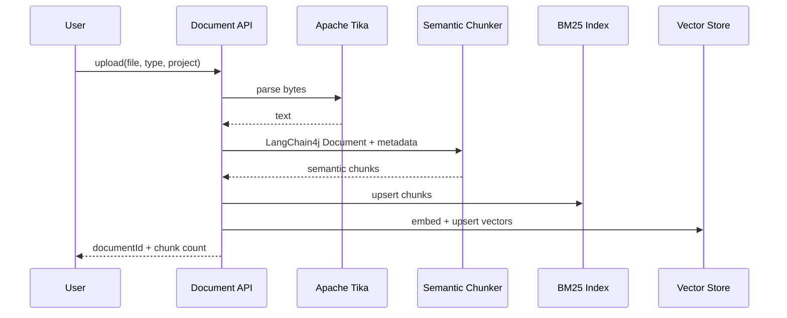
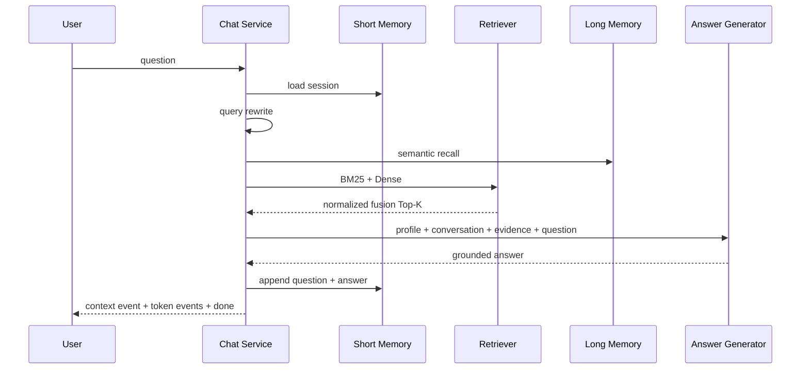

# RAG Flow

## Ingestion

## Query

## Debugging order

1. 调用 `/api/retrieval/debug`，检查期望文本块是否出现。
2. 若未出现，检查文档解析、分块、关键词、Top-K、阈值和融合权重。
3. 若已出现但回答未采用，检查 Prompt、证据数量和生成模型。
4. 用人工标注的 Question → relevant chunk 数据集计算 Recall@K、MRR 和 nDCG，禁止用主观示例代替评测。
